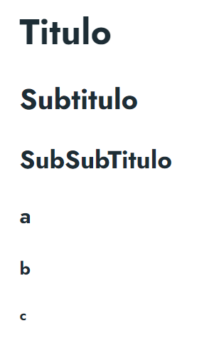

## Estructura de carpetas 

Dentro de la carpeta ```docs``` existen diferentes carpetas donde están organizados todos los proyectos/categorías. También algunas carpetas que vienen de prueba cuando instalas el Doks, las cuales muestran algunas de las funcionalidades del módulo. 

Si acabas de descargarte e instalado hugo y doks es recomendable echarle un vistazo a la carpeta prologue dentro de docs para ver un poco la organización que sigue. 

### Nuevo proyecto/categoría

Para crear un nuevo proyecto/categoría primero tendremos que crear una carpeta dentro de docs. Esta puede tener cualquier nombre pero se recomienda que indique el proyecto que es. A continuación se necesita generar un archivo con el nombre **_index.md**. Es importante que siga este nombre ya que si no Doks no lo va a reconocer. Este archivo cumple la función de especificar datos sobre el proyecto.

El contenido del archivo debe de ser como lo siguiente

```

---
title : "Hugo - Documentación"
description: "Prologue Doks."
lead: ""
date: 2020-10-06T08:48:45+00:00
lastmod: 2020-10-06T08:48:45+00:00
draft: false
weight: 0
---


```

Esto es lo que llamamos cabecera. Sus parámetros son los siguientes

- title: nombre que queramos que aparezca en el indice de proyectos. 
- description: breve descripción del proyecto
- lead: lo que aparecerá en el primer párrafo. En este caso no sirve de nada ya que esta página no se verá. Si nos será útil cuando estemos escribiendo el contenido de la página
- date y lastmod: fecha de creación y modificación respectivamente
- draft: indica si es un borrador.
<!-- - images: imagenes que se van a usar. Como lead, tampoco nos resultará útil en este momento pero posteriormente sí -->
- weight: La posición que ocupará en el indice. 100 es la primera, 110 la segunda, 120 la segunda...


El weight en el sidebar por defecto se hace de forma inversa para los menús. Para cambiar esto, vamos al archivo layouts/partials/sidebar/auto-collapsible-menu.html y cambiamos la linea:

```
{{ range .Sections.ByWeight.Reverse }}
```

por:

```
{{ range .Sections.ByWeight }}
```


### Contenido en el proyecto

Como se ha mencionado anteriomente, esta página del menu no es accesible. Podemos añadir contenido debajo de la cabecera pero a menos que cambiemos la url no podremos acceder manualmente a esta. Tampoco es que sea necesario ya que la barra de la izquierda nos permitirá navegar entre los proyectos, lo que quita la necesidad de entrar a la página de un proyecto. 

## Crear contenido

Crear contenido es muy similar a crear un proyecto. De hecho, es necesario poner la cabecera que hemos mencionado anteriormente y especificar el orden con weight, especificar un nombre, el lead, etc

Debajo de esto empezaremos a redactar el contenido.

Para insertar texto simple, tendremos que simplemente escribirlo debajo de la cabecera. A continuación se explicará más en detalles características especiales de markdown y hugo. 

Cabe destacar que el plugin Doks utiliza una especie de "compilador de markdown" llamado goldmark. Este permite instalar plugin que extienden la funcionalidad del markdown básico

### Tipo de titulos

Podremos especificar el tamaño de los titulos usando el caracter **#**. Todos los titulos que añadamos se pondrán en el índice de la derecha de la página automáticamente

Dependiendo de cuantas # pongamos el titulo será más grande o menos. Por ejemplo:

```
# Titulo
## Subtitulo
### SubSubTitulo
#### a
##### b
###### c
```

Esto generá lo siguiente:




### Imágenes

<!--  -->

Si queremos incluir imágenes primero tendremos que crear una carpeta nueva dentro del proyecto para la página de contenido que estemos redactando actualmente. Se recomienda llamarla igual que el archivo markdown que estabamos redactando. A continuación moveremos el archivo md con el contenido que estabamos redactando a esta carpeta, cambiandole el nombre a **index.md**. Aunque le estemos cambiando el nombre y la carpeta padre, la cabecera funcionará exactamente igual, por lo que no tendremos que cambiar la configuración. 

```goat
..
├── blog/
│   ├── say-hello-to-doks/
│   │   ├── index.md
│   │   └── say-hello-to-doks.png
│   └── _index.md
└── _index.md

```
A continuación, meteremos todas las imágenes que queramos usar dentro de esta carpeta. Para mostrarlas en la página usaremos lo siguiente

```

```
donde:

- cap es el nombre que queremos ponerle a la imágen en la página. Puede ser cualquiera y no tiene que ser igual al nombre del archivo
- Captura.png es la imágen que queremos poner. 


<!-- <ul class="task-list">
    <li><input type="checkbox"  class="task-list-item"> a task list item</li>
    <li><input type="checkbox" disabled="" class="task-list-item"> list syntax required</li>
    <li><input type="checkbox" disabled="" class="task-list-item"> incomplete</li>
    <li><input type="checkbox" checked="" disabled="" class="task-list-item"> completed</li>
</ul>

- [ ] Mercury   
- [ ] Venus
- [ ] Earth (Orbit/Moon)
- [ ] Mars
- [ ] Jupiter
- [ ] Saturn
- [ ] Uranus
- [ ] Neptune
- [ ] Comet Haley

 -->
